# DeadNeurons

[](https://github.com/Rekhii/DeadNeurons/actions/workflows/ci.yml)

A neural decoder that monitors its own hidden neurons, detects when they die, and reinitializes them automatically during training. Built from scratch in NumPy. Trained on real Neuropixels brain recordings. Served via production-oriented MLOps infrastructure.

**[Live Dashboard](https://deadneurons.streamlit.app)** · **[Live API Docs](https://deadneurons.onrender.com/docs)** · **[Model Registry](https://huggingface.co/datasets/rekhi/deadneurons-registry)**

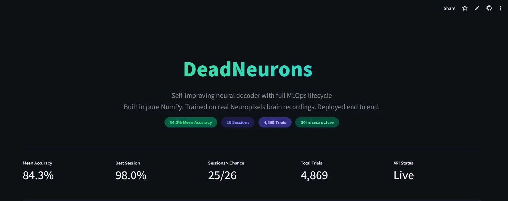

---

## The Problem

Standard neural networks silently accumulate dead neurons during training. A neuron's weights drift into a region where ReLU outputs zero for every input. The gradient becomes zero. The weights never update again. The neuron is permanently dead. Nobody notices until accuracy plateaus and nobody knows why.

DeadNeurons solves this by adding a self-improvement cycle after every training epoch: observe each neuron's activation statistics, diagnose dead or saturated neurons, and correct them through targeted weight reinitialization. The network watches itself and heals itself.

---

## How the Brain Data Was Collected

The Steinmetz 2019 dataset contains real neural recordings from mice performing a visual decision task, published in Nature.

### Surgical Preparation

A cranial window is implanted over the mouse's brain. The skull is thinned or removed in a small region and replaced with a glass coverslip, allowing electrical access to the brain tissue underneath. A metal headplate is cemented to the skull so the mouse can be head-fixed during recording sessions.

<p align="center">
  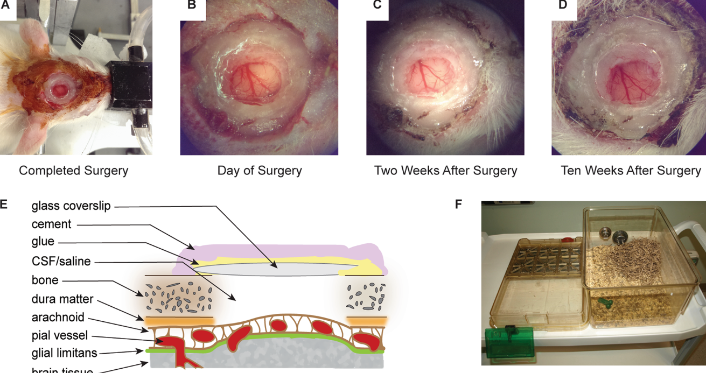
</p>

### Neural Recording

Neuropixels probes are thin silicon needles with 384 electrodes along their shaft. They are inserted through the cranial window deep into the brain, passing through multiple brain regions simultaneously. Each electrode picks up electrical signals (action potentials) from nearby neurons. A single probe can record from 474 to 1,769 neurons at once across areas like visual cortex (VISp), motor cortex (MOs), hippocampus (CA3, DG), and thalamus.

<p align="center">
  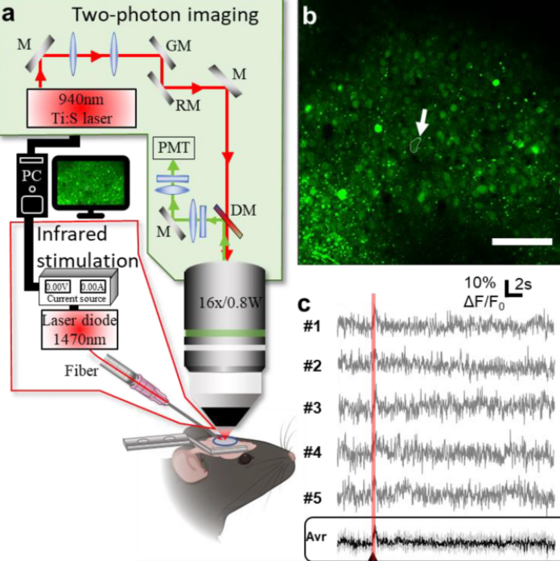
</p>

### The Behavioral Task

The mouse sits head-fixed in front of two screens. Each screen displays a visual pattern at a certain contrast level (0, 0.25, 0.5, or 1.0). The mouse must identify which screen is brighter and turn a wheel left or right to indicate its choice. Correct responses are rewarded. Each trial lasts about 2.5 seconds.

<p align="center">
  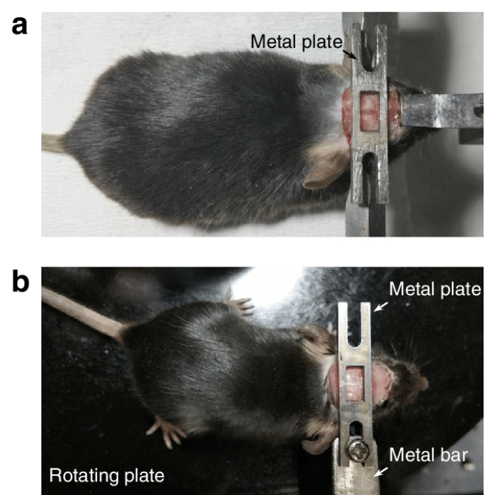
</p>

### Dataset Summary

| Property | Value |
|----------|-------|
| Sessions | 26 |
| Mice | 7 (Cori, Forssmann, Hench, Lederberg, Moniz, Muller, Radnitz) |
| Usable trials | 4,869 |
| Neurons per session | 474 to 1,769 |
| Time bins per trial | 250 (10ms each = 2.5 seconds) |
| Brain regions | Up to 15 per session |
| Labels | Left turn (0) or Right turn (1) |

---

## System Architecture

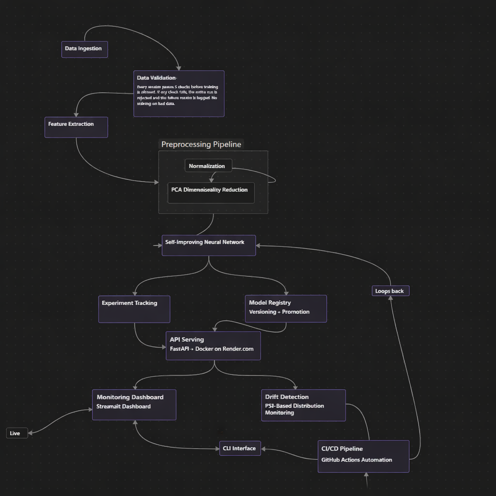

| Step | Component | Technology | Purpose |
|------|-----------|-----------|---------|
| 1 | Data Ingestion | NumPy .npz | Load 26 sessions from 7 mice |
| 2 | Data Validation | Custom validator | 5 quality checks before training is allowed |
| 3 | Feature Extraction | Custom extractor | Mean firing rates in 4 biologically meaningful time windows |
| 4 | PCA | Custom (no sklearn) | Reduce 2,936+ features to 50 principal components |
| 5 | Self-Improving Classifier | Pure NumPy | Observe, diagnose, correct dead neurons each epoch |
| 6A | Experiment Tracker | SQLite | Log hyperparams, metrics, git commit per run |
| 6B | Model Registry | Hugging Face Hub | Versioned weights with accuracy-based promotion |
| 7 | API Serving | FastAPI + Docker | REST endpoints on Render.com |
| 8A | Dashboard | Streamlit Cloud | Live metrics, charts, interactive prediction |
| 8B | Drift Detection | PSI (NumPy) | Monitor feature distribution shifts |
| 9 | CI/CD | GitHub Actions | Tests on push, weekly retrain cron |

---

## The Self-Improvement Cycle

After every standard training epoch (forward pass, loss, backward pass, weight update), the network runs three additional phases:

**1. Observe:** Run a fresh forward pass on training data. Record the mean activation and standard deviation of each hidden neuron across all samples.

**2. Diagnose:** Check for two failure modes:
- Dead neuron: mean < 1e-6 AND std < 1e-6 (outputs zero for every input, gradient always zero, weights never update)
- Saturated neuron: mean > 5.0 AND std < 0.1 (same output for everything, no discrimination)

**3. Correct:** Fix broken neurons:
- Dead: reinitialize incoming and outgoing weights with fresh He initialization, set bias to 0.01
- Saturated: scale weights by 0.5 to pull out of saturation

## Key Result: Self-Improving Training Works

| Metric | Without Self-Improvement | With Self-Improvement |
|--------|--------------------------|----------------------|
| Dead neurons after kill | 10/32 stayed dead | 10/32 detected and fixed in 1 epoch |
| Accuracy after neuron death | 52.5% (dropped from 60%) | 62.5% (recovered and exceeded baseline) |
| Detection rate | 0% (standard training is blind) | 100% (every dead neuron caught) |
| Recovery time | Never (permanent damage) | 1 epoch (immediate correction) |

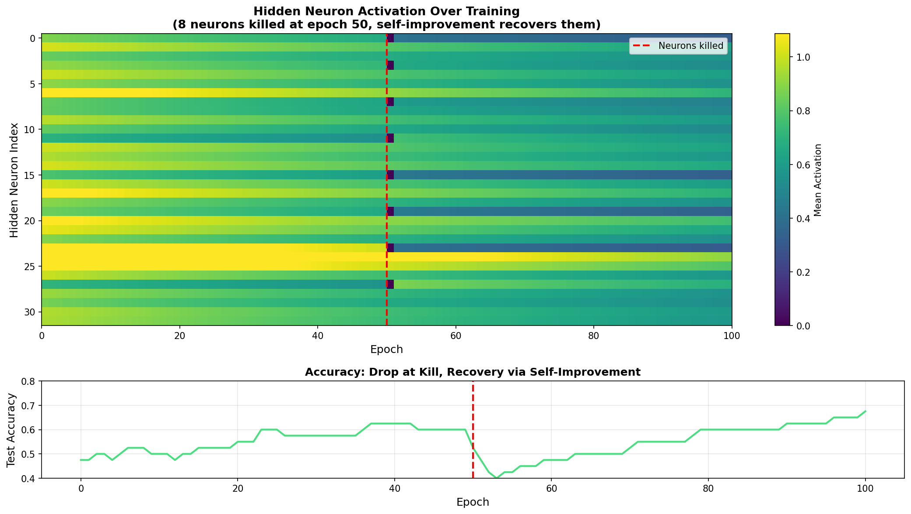

*Top: Hidden neuron activations over 100 epochs. 8 neurons killed at epoch 50 (dark spots). Self-improvement detects and reinitializes them within one epoch. Bottom: Accuracy drops at kill, recovers through self-correction.*

**Test on synthetic data:**

| Phase | Accuracy | Dead Detected | Dead Fixed |
|-------|----------|---------------|------------|
| After normal training (50 epochs) | 60.0% | 0 | 0 |
| After killing 10/32 neurons | 52.5% | 10 | - |
| After recovery (50 epochs) | 62.5% | - | 10 |

All 10 killed neurons detected on epoch 0 of recovery. Accuracy recovered and exceeded the pre-kill baseline.

**Test on real Steinmetz data (Session 10, Hench):**

| Phase | Accuracy | Dead Detected | Dead Fixed |
|-------|----------|---------------|------------|
| After normal training (100 epochs) | 87.8% | 0 | 0 |
| After killing 20/64 neurons | 91.8% | 20 | - |
| After recovery (100 epochs) | 89.8% | - | 20 |

All 20 killed neurons detected and fixed on the first recovery epoch. 100% detection rate on real brain data.

---

## Results

### Decoding Accuracy Across All 26 Sessions

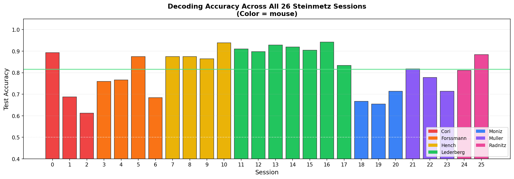

84.3% mean accuracy across all sessions. 25 out of 26 sessions decode above chance (50%). Best session: 98.0% (Session 10, Hench). Hardest session: 61.4% (Session 2, Cori).

### Multi-Run Consistency

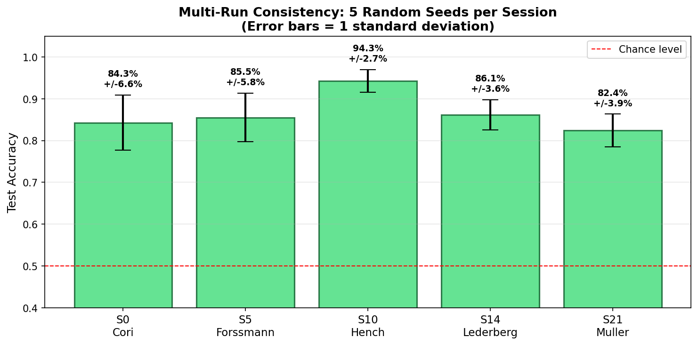

Each session trained with 5 different random seeds. Results are consistent, not a lucky outcome. Standard deviation ranges from 2.7% to 6.6% across seeds. Session 10 (Hench) is the most stable at 94.3% +/- 2.7%.

### Per-Session and Per-Mouse Breakdown

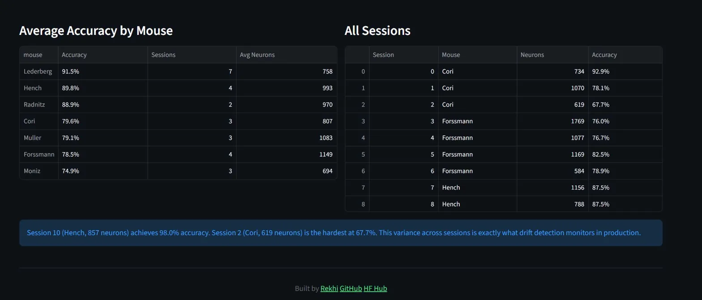

Lederberg has the highest average accuracy (91.5%) across 7 sessions. Moniz is the hardest mouse (74.9%). This variance across sessions is what drift detection monitors in production.

---

## Live API

The production model (v5, 98.0% accuracy) is served via FastAPI on Render.com.

**Health check:**
```bash
curl https://deadneurons.onrender.com/health
```
```json
{"status": "healthy", "model_loaded": true, "model_version": "v5"}
```

**Prediction:**
```bash
curl -X POST https://deadneurons.onrender.com/predict \
  -H "Content-Type: application/json" \
  -d '{"features": [0.5, -1.2, 0.8, 0.3, -0.7, 1.1, -0.4, 0.9, -1.5, 0.2, 0.6, -0.8, 1.3, -0.1, 0.4, -1.0, 0.7, 0.2, -0.5, 1.4, -0.3, 0.8, -1.1, 0.6, 0.1, -0.9, 1.2, -0.6, 0.3, -1.3, 0.5, 0.9, -0.2, 1.0, -0.7, 0.4, -1.4, 0.8, 0.1, -0.5, 1.1, -0.3, 0.7, -1.2, 0.6, 0.2, -0.8, 1.3, -0.4, 0.9]}'
```
```json
{"prediction": 0, "label": "left", "confidence": 0.4334}
```

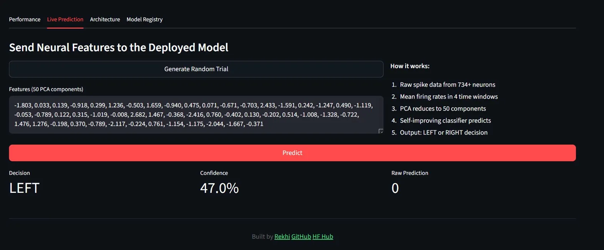

> Note: The API is on Render free tier. It sleeps after 15 minutes of inactivity. First request after sleep takes about 50 seconds.

---

## Model Registry

5 model versions tracked on Hugging Face Hub with automated promotion logic. A new model only gets promoted to production if it beats the current production model's accuracy.

| Version | Accuracy | Config | Status |
|---------|----------|--------|--------|
| v1 | 92.86% | hidden=32, session 0 | Retired (beaten by v5) |
| v2 | 89.29% | hidden=16, session 0 | Candidate |
| v3 | 82.14% | hidden=64, session 0 | Candidate |
| v4 | 84.31% | hidden=32, all sessions | Candidate |
| v5 | 97.96% | hidden=32, session 10 | **Production** |

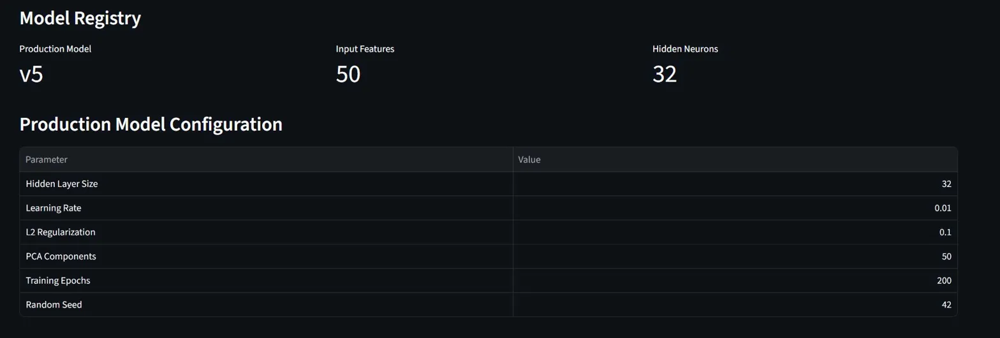

---

## Live Dashboard

Interactive monitoring dashboard at [deadneurons.streamlit.app](https://deadneurons.streamlit.app):

**Performance tab:** Accuracy bar chart across all 26 sessions, average accuracy by mouse, full session detail table.

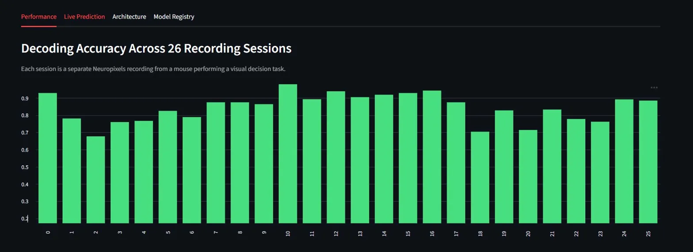

**Live Prediction tab:** Generate random neural features, send to the deployed API, see the decision and confidence in real time.

**Model Registry tab:** Current production model configuration, promotion logic explanation, link to HF Hub.

---

## Project Structure

```
DeadNeurons/
  src/
    features/extractor.py           # Spike data loading and feature extraction
    model/classifier.py             # Self-improving neural network
    tracking/tracker.py             # Experiment tracking (SQLite)
    registry/registry.py            # Model versioning (HF Hub)
    validation/validator.py         # Pre-training data quality checks
    monitoring/drift_detector.py    # PSI-based drift detection
    api/main.py                     # FastAPI prediction endpoints
  dashboard/app.py                  # Streamlit monitoring dashboard
  tests/
    test_self_improvement.py              # Proof: dead neuron detection (synthetic)
    test_self_improvement_steinmetz.py    # Proof: dead neuron detection (real data)
  notebooks/evidence.py             # Generate all evidence charts
  .github/workflows/
    ci.yml                          # Tests on every push
    retrain.yml                     # Weekly retraining + manual trigger
  train.py                          # Main training script with CLI
  Dockerfile                        # Container for API deployment
```

---

## Quick Start

```bash
git clone https://github.com/Rekhii/DeadNeurons.git
cd DeadNeurons
pip install -r requirements.txt

# Train single session
python train.py --session 0 --epochs 150

# Train all sessions
python train.py --epochs 150

# Run self-improvement proof
python tests/test_self_improvement.py

# View experiment history
python -m src.tracking.tracker list

# Compare two runs
python -m src.tracking.tracker compare <run_id_1> <run_id_2>

# Check model registry
python -m src.registry.registry list

# Generate evidence charts
python notebooks/evidence.py
```

---

## Tech Stack

| Component | Tool | Why |
|-----------|------|-----|
| Core Model | Pure NumPy | Full visibility into weights and per-neuron stats |
| API | FastAPI | Auto-docs, Pydantic validation, industry standard |
| Container | Docker | Reproducible builds, Render deployment |
| Deployment | Render.com | Free tier, Docker support, auto-deploy |
| Dashboard | Streamlit Cloud | Free hosting, Python-native |
| Registry | Hugging Face Hub | Free versioned artifact storage |
| Tracking | SQLite | Custom built, no MLflow dependency |
| CI/CD | GitHub Actions | Tests on push, weekly retrain |
| Drift | PSI (NumPy) | Interpretable thresholds for tabular features |
| **Total Cost** | **$0** | **Entire stack on free tier** |

---

## Implementation Status

**Fully implemented and working:**
- Self-improving classifier with observe/diagnose/correct cycle (proven with structured tests)
- Feature extraction from real Neuropixels data (26 sessions, 4,869 trials)
- PCA from scratch (accuracy improved from 64.3% to 92.9%)
- Experiment tracking with SQLite (CLI: list, show, compare)
- Model registry with promotion logic on HF Hub (5 versions, promotion demonstrated)
- Data validation with 5 quality checks
- PSI-based drift detection with configurable thresholds
- FastAPI + Docker deployed on Render.com (4 endpoints, live)
- Streamlit dashboard with live API integration (4 tabs, live)
- CI/CD with GitHub Actions (tests on push, weekly retrain cron)

**Infrastructure ready, needs production data flow:**
- End-to-end retraining triggered by drift (components work individually, not yet connected to live data stream)
- Prediction logging for production monitoring (endpoint exists, not persistent on free tier)

**Planned:**
- GPU acceleration via CuPy
- Cross-session transfer learning
- Streaming drift monitoring with webhook alerts

---

## Author

[Rekhi](https://github.com/Rekhii) · [Kaggle](https://kaggle.com/seki32)
